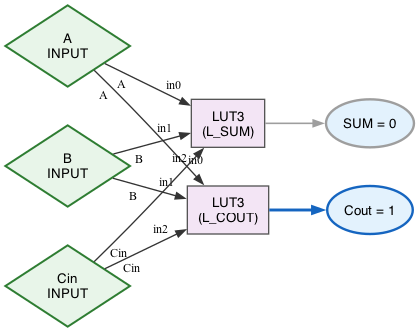

# Digital Logic Simulator (Java)

_Current release_: **v0.1.0**


**Combinational logic simulator** with gates, wires, named primary I/O, and a deterministic **topological evaluation** engine. Built with **Java + Gradle + JUnit**, emphasizing **DSA**, **SWE best practices**, and concepts adjacent to **FPGA/EDA** flows. 

**Performance note:** Replaced an iterative "until stable" loop with a single-pass **topological evaluation** (Kahn's algorithm) and immediate wire propagation. Added explicit **cycle detection**. Result: ~195× speedup on 1k-gate DAG (1509 ms → 7.7 ms for 100 runs).

_Tags_: Java, DSA, Graph Algorithms, ECE, FPGA-adjacent, Gradle, JUnit

-blue)


---

## Why this matters (FPGA / ECE / SWE)

- Models a **netlist-like graph** (gates = nodes, wires = edges), then evaluates in **topological order** (Kahn’s algorithm) with **cycle detection**—the same graph ideas behind **EDA/FPGA** toolchains.
- Clear **time complexity (O(V+E))**, **unit tests**, and **CLI builds** → strong **SWE** hygiene plus **DSA** reasoning.
- Extensible: add **NAND/NOR**, **critical path** (timing proxy), **sequential elements** (DFF), or **fault injection** (reliability)—useful talking points for ECE/FPGA roles.


---

## Features

- Gates: **AND, OR, NOT, XOR** (+ composition tests)
- **Deterministic `propagate()`** using **topological sort**; throws **`IllegalStateException("Cycle detected")`** for loops
- Named **primary inputs/outputs**
- **JUnit** truth-table & negative tests
- **Gradle** build/test; runs on **Java 21+** (developed & tested on **Java 24**)

---

## Public API (quick)

- `Gate` (abstract): `setInput(pin, v)`, `getOutput(pin)`, `evaluate()`, `getNumInputs()`, `getNumOutputs()`, `getId()`
- `Wire`: `fromGate/outPin → toGate/inPin`, `read()`, getters for pins and gates
- `Circuit`:
  - Build: `addGate(g)`, `addWire(w)`
  - I/O: `connectPrimaryInput(name, gate, pin)`, `setPrimaryInput(name, value)`, `addPrimaryOutput(gate)`, `readPrimaryOutputs()`
  - Exec: `propagate()` (topo sort + immediate wire push, **cycle detection**)

---

## Structure

lib/
  ├─ build.gradle
  └─ src
     ├─ main/java/sim/core/        # Circuit, Gate, Wire, And/Or/Not/Xor
     ├─ main/java/sim/dot/         # GraphvizExporter, GraphvizDemo
     └─ test/java/sim/core/        # JUnit tests (topo, cycle, truth-tables)
docs/
  ├─ logic.dot
  ├─ logic.png
  └─ issues-log.md

---

## Requirements

- **Java 21+** (LTS recommended; developed on **Java 24**)
- **Gradle wrapper included** (`./gradlew`), no global Gradle needed
- macOS/Linux/WSL-bash/PowerShell

---

## Quick start

```bash
# clone, build, test
git clone https://github.com/gquar/java-logic-sim.git
cd java-logic-sim
./gradlew :lib:build
./gradlew :lib:test

```


## Example Circuit (tiny demo)

```java
// (A AND B) OR (NOT C)
Circuit c = new Circuit();
// build gates, connect wires, set inputs, then:
c.propagate();
System.out.println(c.readPrimaryOutputs().get(0));
```

## Design Notes

- *Graph model*: gates = nodes, wires = edges
- *Topological sort*: Kahn’s algorithm (queue) — O(V+E)
- *Cycle detection*: `if processed < total`, throw: 
```java
 throw IllegalStateException("Cycle detected")
 ```
- *Propagation*: single pass in topo order; push outputs immediately after each gate’s `evaluate()`

---

## Tests

```bash
./gradlew :lib:test
```
*Included*:
- **XOR truth table**
- **Negative cycle test**: `assertThrows(IllegalStateException)` and message contains `"Cycle detected"`
- Composition / fan-in / fan-out checks

---

## Visuals (Graphviz)

**(A AND B) OR (NOT C)**


**Full Adder (A,B,Cin → SUM,Cout)**


### Legend
**Green diamonds** = primary inputs; **Blue ovals** = primary outputs. Output oval text shows resolved value (0/1). **Bold blue edge** = 1, **gray edge** = 0.
- **Green diamonds**: primary inputs.  
- **Blue ovals**: primary outputs (label shows resolved value).  
- **Boxes**: gates (AND / OR / NOT / XOR / LUT).  
- **Edge color**: bold blue = logic 1; gray = logic 0.  

Regenerate:
```bash
./gradlew :lib:logicDot
./gradlew :lib:faDot   # auto-opens fa.png on desktop systems
# or both:
./gradlew :lib:dotAll
```

## Grid frames (AE-ready)

Generate a **2D boolean grid** per frame (PNG) plus a CSV of outputs:

```bash
./gradlew :lib:reg2Grid
```

**Files:**
- `docs/frames_grid/reg_00.png` … `reg_03.png`
- `docs/frames_grid/frames.csv` (columns: `frame,q0,q1`)

**Why:** these are simple image-sequence frames you can import into After Effects for a clean, program-generated animation (no hand-drawn fakes). Each title line encodes Q0/Q1 so the result is self-describing.

## LUT + FPGA-lite

**Configurable 3-input lookup tables** demonstrate FPGA-style logic synthesis. Each LUT3 stores an 8-bit truth table mask, enabling arbitrary boolean functions.

```bash
./gradlew :lib:lutDot  # auto-opens docs/lut_fabric.png
```



## Threshold Mask (image→grid)

Convert images to boolean grids via **grayscale thresholding**:

```bash
./gradlew :lib:threshold -- --in image.png --threshold 128 --out docs/threshold/out.png
```

**Features:** luma conversion, invert option, CSV export. Perfect for OCR preprocessing or binary image analysis.

## 3D LUT (.cube)

**FPGA-like ROM mapping** for color transformations. Generate LUTs from source/target image pairs, apply to new images:

```bash
# Generate LUT from image pair
java -cp lib/build/classes/java/main sim.image.lut.CubeCLI generate --src before.png --tgt after.png --size 17 --out lut.cube --preview preview.png

# Apply LUT to image
java -cp lib/build/classes/java/main sim.image.lut.CubeCLI apply --in input.png --cube lut.cube --out output.png
```

**Concept demo:** `./gradlew :lib:lutCubeDot` shows R,G,B → LUT3D → R',G',B' schematic.

### 3D Color-Grading LUT (.cube) — Auto Size Selection

Learn a LUT from a matched pair of images (Source=ungraded, Target=graded). Optimize LUT size by sweeping (e.g., 9,17,33) and picking the smallest meeting a PSNR goal (default 36 dB).

**Commands:**
```bash
# Optimize size and generate outputs
./gradlew :lib:lutOptimize

# (Example) Generate a 17³ LUT and apply it:
java -cp lib/build/libs/lib-*.jar sim.image.lut.CubeCLI generate --src docs/samples/src.png --tgt docs/samples/tgt.png --size 17 --out docs/lut/cube_17.cube --preview docs/lut/cube_17_preview.png
java -cp lib/build/libs/lib-*.jar sim.image.lut.CubeCLI apply --in docs/samples/new.png --cube docs/lut/cube_17.cube --out docs/lut/applied.png

# (Optional) Plot error vs size (requires matplotlib):
python3 tools/plot_lut_opt.py docs/lut_opt/results.csv docs/lut_opt/plot.png
```

**Practical notes:**
- Assumes sRGB. For learning & interpolation we may switch to linear in a future version.
- Best results when the Source/Target are the same scene, same resolution, no geometric edits.

**Validation Support:**
Validation images help prevent overfitting to the training data. When training and testing on the same image pair, PSNR can be ∞ for all sizes, making size selection difficult.

```bash
# With validation images
./gradlew :lib:lutOptimize -PvalSrc=docs/samples/val_src.png -PvalTgt=docs/samples/val_tgt.png
python3 tools/plot_lut_opt.py docs/lut_opt/results.csv docs/lut_opt/plot.png
```

The validation PSNR will typically be lower than training PSNR, providing a clearer size/quality tradeoff for optimization.

### Nearest vs Trilinear Interpolation

Compare interpolation methods for LUT application:

```bash
./gradlew :lib:lutCompare
```

This generates side-by-side comparison images showing the difference between nearest neighbor and trilinear interpolation. Trilinear typically produces smoother gradients with fewer quantization artifacts, especially for small LUT sizes.

### Netlist DSL (tiny)

Parse and execute simple netlist descriptions:

```bash
# Example netlist (docs/samples/adder1.nl):
INPUTS A,B,Cin
X1 = XOR(A,B)
SUM = XOR(X1,Cin)
C1  = AND(A,B)
C2  = AND(X1,Cin)
Cout= OR(C1,C2)
OUTPUTS SUM,Cout

# Run demo:
./gradlew :lib:netlistDemo
```

The DSL supports AND, OR, NOT, XOR gates with named inputs/outputs and optional Graphviz visualization.
```markdown
<details><summary>Mermaid (browser-native)</summary>

```mermaid
graph LR
  A((A)):::in --> AND1
  B((B)):::in --> AND1
  C((C)):::in --> NOT1
  AND1 --> OR1
  NOT1 --> OR1
  OR1 --> Z((OUTPUT))
  classDef in fill:#e8f5e9,stroke:#2e7d32,color:#000;
</details> ```

---

## Roadmap

- Mini netlist DSL + CLI loader
- **D flip-flop** + `tick()` (sequential logic)
- Critical path (longest path in DAG)
- GitHub Actions CI (Java 21 matrix)

---

## Benchmarks

**Scenario:** DAG ≈ 1,000 gates, 100 calls to `propagate()`  
**Machine:** macOS, CPU/RAM (fill in), Java 24.0.2, Gradle wrapper

- **Before:** 1509.101 ms total → **15.0910 ms/run**
- **After:** **7.728 ms** total → **0.0773 ms/run**

**~195× speedup** from:
- Kahn’s topological evaluation (O(V+E))
- Immediate wire propagation
- JIT warm-up & targeted bench harness

**Benchmark (linear-time scaling)**
*Method:* Per-size warm-up then median of 5 repeats (each repeat runs propagate() 500×):
- Warm-up per size: 200 runs
- Repeats: 5; report median
- Java 24 (JIT warmed), Gradle wrapper
- Circuit: Not-gate chain (≈O(n) work)

| Gates | Median total (ms) | Median avg per run (ms) |
|------:|------------------:|------------------------:|
|   100 | 1.603             | 0.003206                |
|   200 | 3.061             | 0.006122                |
|   500 | 3.225             | 0.006449                |
|  1000 | 6.340             | 0.012680                |
|  2000 | 12.212            | 0.024425                |


*Takeaway*. Runtime scales **~linearly** with gates.
For sizes ≥500, the slope is ≈ **1.2×10⁻⁵ ms per gate** (≈ 12–13 ns/gate), with near-zero intercept. Doubling the circuit (1k→2k) roughly doubles runtime (0.0127→0.0244 ms/run).

*Small sizes (100–200) show a bit more noise due to fixed overheads; linear trend is clearest from 500→2000.


---

### License
Released under the [MIT License](./LICENSE).

---
