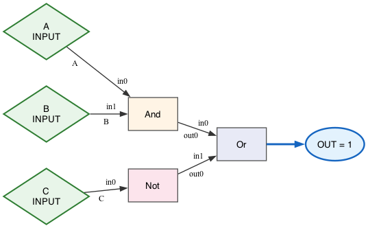

# Digital Logic Simulator (Java)

_Current release_: **v0.1.0**


**Combinational logic simulator** with gates, wires, named primary I/O, and a deterministic **topological evaluation** engine. Built with **Java + Gradle + JUnit**, emphasizing **DSA**, **SWE best practices**, and concepts adjacent to **FPGA/EDA** flows. 

**Performance note:** Replaced an iterative "until stable" loop with a single-pass **topological evaluation** (Kahn's algorithm) and immediate wire propagation. Added explicit **cycle detection**. Result: ~195× speedup on 1k-gate DAG (1509 ms → 7.7 ms for 100 runs).

_Tags_: Java, DSA, Graph Algorithms, ECE, FPGA-adjacent, Gradle, JUnit

-blue)


---

## Why this matters (FPGA / ECE / SWE)

- Models a **netlist-like graph** (gates = nodes, wires = edges), then evaluates in **topological order** (Kahn’s algorithm) with **cycle detection**—the same graph ideas behind **EDA/FPGA** toolchains.
- Clear **time complexity (O(V+E))**, **unit tests**, and **CLI builds** → strong **SWE** hygiene plus **DSA** reasoning.
- Extensible: add **NAND/NOR**, **critical path** (timing proxy), **sequential elements** (DFF), or **fault injection** (reliability)—useful talking points for ECE/FPGA roles.


---

## Features

- Gates: **AND, OR, NOT, XOR** (+ composition tests)
- **Deterministic `propagate()`** using **topological sort**; throws **`IllegalStateException("Cycle detected")`** for loops
- Named **primary inputs/outputs**
- **JUnit** truth-table & negative tests
- **Gradle** build/test; runs on **Java 21+** (developed & tested on **Java 24**)

---

## Public API (quick)

- `Gate` (abstract): `setInput(pin, v)`, `getOutput(pin)`, `evaluate()`, `getNumInputs()`, `getNumOutputs()`, `getId()`
- `Wire`: `fromGate/outPin → toGate/inPin`, `read()`, getters for pins and gates
- `Circuit`:
  - Build: `addGate(g)`, `addWire(w)`
  - I/O: `connectPrimaryInput(name, gate, pin)`, `setPrimaryInput(name, value)`, `addPrimaryOutput(gate)`, `readPrimaryOutputs()`
  - Exec: `propagate()` (topo sort + immediate wire push, **cycle detection**)

---

## Structure

lib/
  ├─ build.gradle
  └─ src
     ├─ main/java/sim/core/        # Circuit, Gate, Wire, And/Or/Not/Xor
     ├─ main/java/sim/dot/         # GraphvizExporter, GraphvizDemo
     └─ test/java/sim/core/        # JUnit tests (topo, cycle, truth-tables)
docs/
  ├─ logic.dot
  ├─ logic.png
  └─ issues-log.md

---

## Requirements

- **Java 21+** (LTS recommended; developed on **Java 24**)
- **Gradle wrapper included** (`./gradlew`), no global Gradle needed
- macOS/Linux/WSL-bash/PowerShell

---

## Quick start

```bash
# clone, build, test
git clone https://github.com/gquar/java-logic-sim.git
cd java-logic-sim
./gradlew :lib:build
./gradlew :lib:test

```


## Example Circuit (tiny demo)

```java
// (A AND B) OR (NOT C)
Circuit c = new Circuit();
// build gates, connect wires, set inputs, then:
c.propagate();
System.out.println(c.readPrimaryOutputs().get(0));
```

## Design Notes

- *Graph model*: gates = nodes, wires = edges
- *Topological sort*: Kahn’s algorithm (queue) — O(V+E)
- *Cycle detection*: `if processed < total`, throw: 
```java
 throw IllegalStateException("Cycle detected")
 ```
- *Propagation*: single pass in topo order; push outputs immediately after each gate’s `evaluate()`

---

## Tests

```bash
./gradlew :lib:test
```
*Included*:
- **XOR truth table**
- **Negative cycle test**: `assertThrows(IllegalStateException)` and message contains `"Cycle detected"`
- Composition / fan-in / fan-out checks

---

## Visuals (Graphviz)

**(A AND B) OR (NOT C)**



**Full Adder (A,B,Cin → SUM,Cout)**


**Legend**
- Ovals display the **resolved output value** (e.g., `SUM = 1`, `Cout = 0`).
- Edge to each output oval is **blue & bold** for `1` and **gray** for `0`.
- Gate boxes show the **type**, and only include the gate id if it differs from the type (no more `AND\AND`).

Regenerate:
```bash
./gradlew :lib:logicDot
./gradlew :lib:faDot   # auto-opens fa.png on desktop systems
# or both:
./gradlew :lib:dotAll
```
```markdown
<details><summary>Mermaid (browser-native)</summary>

```mermaid
graph LR
  A((A)):::in --> AND1
  B((B)):::in --> AND1
  C((C)):::in --> NOT1
  AND1 --> OR1
  NOT1 --> OR1
  OR1 --> Z((OUTPUT))
  classDef in fill:#e8f5e9,stroke:#2e7d32,color:#000;
</details> ```

---

## Roadmap

- Mini netlist DSL + CLI loader
- **D flip-flop** + `tick()` (sequential logic)
- Critical path (longest path in DAG)
- GitHub Actions CI (Java 21 matrix)

---

## Benchmarks

**Scenario:** DAG ≈ 1,000 gates, 100 calls to `propagate()`  
**Machine:** macOS, CPU/RAM (fill in), Java 24.0.2, Gradle wrapper

- **Before:** 1509.101 ms total → **15.0910 ms/run**
- **After:** **7.728 ms** total → **0.0773 ms/run**

**~195× speedup** from:
- Kahn’s topological evaluation (O(V+E))
- Immediate wire propagation
- JIT warm-up & targeted bench harness

**Benchmark (linear-time scaling)**
*Method:* Per-size warm-up then median of 5 repeats (each repeat runs propagate() 500×):
- Warm-up per size: 200 runs
- Repeats: 5; report median
- Java 24 (JIT warmed), Gradle wrapper
- Circuit: Not-gate chain (≈O(n) work)

| Gates | Median total (ms) | Median avg per run (ms) |
|------:|------------------:|------------------------:|
|   100 | 1.603             | 0.003206                |
|   200 | 3.061             | 0.006122                |
|   500 | 3.225             | 0.006449                |
|  1000 | 6.340             | 0.012680                |
|  2000 | 12.212            | 0.024425                |


*Takeaway*. Runtime scales **~linearly** with gates.
For sizes ≥500, the slope is ≈ **1.2×10⁻⁵ ms per gate** (≈ 12–13 ns/gate), with near-zero intercept. Doubling the circuit (1k→2k) roughly doubles runtime (0.0127→0.0244 ms/run).

*Small sizes (100–200) show a bit more noise due to fixed overheads; linear trend is clearest from 500→2000.


---

### License
Released under the [MIT License](./LICENSE).

---
